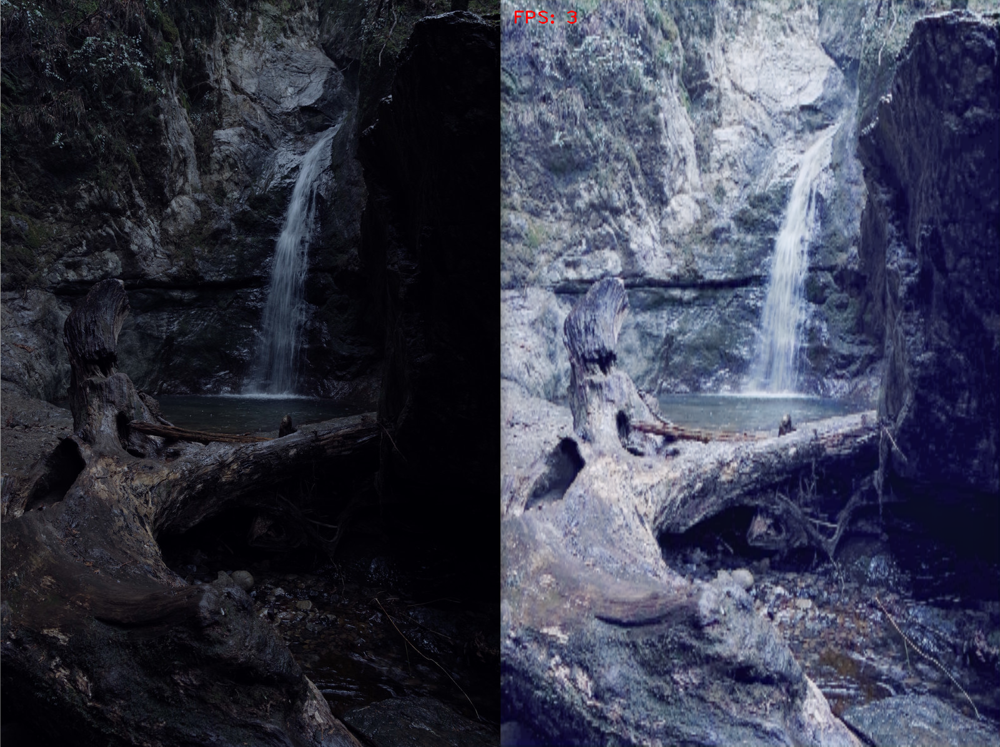
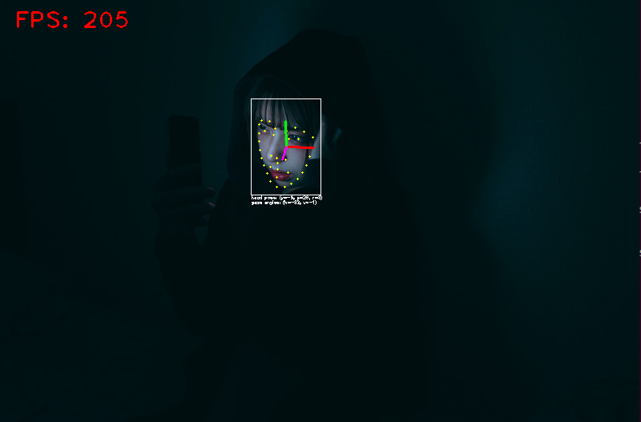

## Installation
All the examples need [installation of openvino](https://docs.openvino.ai/latest/openvino_docs_install_guides_installing_openvino_linux.html).

## [Low Light Enhancement](./low_light_enhancement/README.md)

This image is from [pakutaso](https://www.pakutaso.com/20210527134post-34854.html).

## [Gaze Estimator](./gaze_estimator/README.md)

The image is from [pakutaso](https://www.pakutaso.com/20210212050post-33462.html).