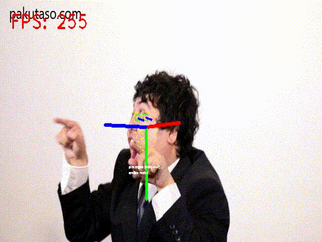

## Installation
Requires installation of very latest opencv and onnxruntime.

```sh
# Install very latest opencv
pip install https://github.com/xiong-jie-y/g_api_examples/releases/download/0.1.0/opencv_contrib_python-4.6.0+5de8d66-cp38-cp38-linux_x86_64.whl

# Install onnxruntime
wget https://github.com/microsoft/onnxruntime/releases/download/v1.11.1/onnxruntime-linux-x64-gpu-1.11.1.tgz
tar xvf onnxruntime-linux-x64-gpu-1.11.1.tgz
sudo cp -r onnxruntime-linux-x64-gpu-1.11.1/lib/ /usr/lib/onnxruntime/

# Run demo :D

```

## [Face Perception for ONNX](./face_perception/)


This image is from [pakutaso](https://www.pakutaso.com/20210527134post-34854.html).

## [Low Light Enhancement for onnx](./low_light_enhancement_onnx/)


This image is from [pakutaso](https://www.pakutaso.com/20210527134post-34854.html).

## [Gaze Estimator for OpenVINO](./gaze_estimator/)


The image is from [pakutaso](https://www.pakutaso.com/20210212050post-33462.html).

## [Tracking](./tracking_example/)


The video is from [pexels](https://www.pexels.com/ja-jp/video/9862111/).