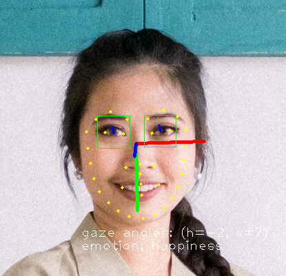

## perceive_face.py
This script can perceive face with the following information.

* Face locations
* Face landmarks
* Head direction
* Emotion
* Eye close-open status
* Gaze direction

The image below is the example of the face perception result of this script.

This image is from https://www.pexels.com/ja-jp/photo/11309593/.

## How to get models
Please download all the models [from](https://github.com/xiong-jie-y/g_api_examples/releases/tag/0.1.1) here and place under models directory.

### Original Models
Just get models from these URLS.
* [emotion-ferplus-8](https://github.com/onnx/models/tree/main/vision/body_analysis/emotion_ferplus)
* [open-closed-eye](https://docs.openvino.ai/latest/omz_models_model_open_closed_eye_0001.html)
* [6drepnet](https://github.com/PINTO0309/PINTO_model_zoo/tree/main/300_6DRepNet)
* [yunet](https://github.com/Kazuhito00/YuNet-ONNX-TFLite-Sample)
* [ultraface](https://github.com/onnx/models/tree/main/vision/body_analysis/ultraface)

For others models, openvino2tensorflow is used to convert them.
* [head pose estimation](https://docs.openvino.ai/2019_R1/_head_pose_estimation_adas_0001_description_head_pose_estimation_adas_0001.html)
* [facial landmarks](https://docs.openvino.ai/2019_R1/_facial_landmarks_35_adas_0002_description_facial_landmarks_35_adas_0002.html)
* [gaze estimation](https://docs.openvino.ai/2019_R1/_gaze_estimation_adas_0002_description_gaze_estimation_adas_0002.html)